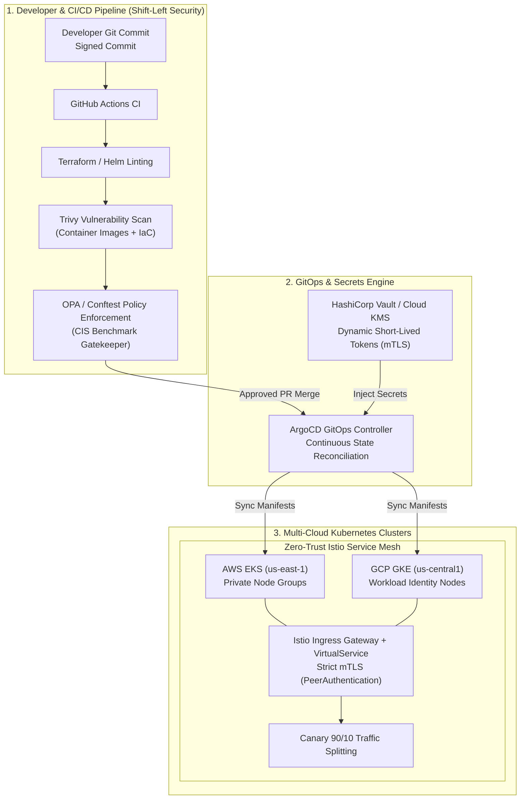

# Enterprise Multi-Cloud GitOps & Zero-Trust Infrastructure Pipeline 🛡️

> **Production-grade, automated multi-cloud provisioning and application delivery system spanning AWS (EKS) and GCP (GKE) with GitOps continuous synchronization, HashiCorp Vault dynamic credentials, and Policy-as-Code CIS benchmark enforcement.**

---

**Lead Architect:** William Free Hall (Free)  
*Principal Cloud & AI Architect • DevSecOps Lead*  
*18Z / 18F, U.S. Army Special Forces (Ret.)*  
**Email:** [whall4.wh@gmail.com](mailto:whall4.wh@gmail.com) • **LinkedIn:** [william-free-hall](https://linkedin.com/in/william-free-hall)

[](terraform/)
[](helm/)
[](argocd/)
[](terraform/modules/vault/)
[](policy/)
[](.github/workflows/)

---

## 🎯 Executive Problem Statement

Enterprise engineering organizations scaling multi-cloud Kubernetes clusters frequently struggle with:
1. **Configuration Drift & Inconsistent Multi-Cloud Topology:** Disconnected manual deployments across AWS and GCP create fragile, non-reproducible infrastructure.
2. **Static Credential Exposure:** Long-lived IAM access keys and Kubernetes secrets checked into code or static vaults present critical lateral movement vectors.
3. **Delivery Bottlenecks & Risky Releases:** Monolithic deployment procedures without automated Canary/Blue-Green traffic migration lead to deployment anxiety and unexpected outages.
4. **Late-Stage Compliance Failures:** Security and CIS benchmark scanning performed after deployment rather than shifted left as Policy-as-Code gatekeepers in CI/CD.

This project implements a **zero-trust, fully automated GitOps engine** addressing these exact operational challenges.

---

## 🏛️ System Architecture



---

## ⚙️ Key Architectural Engineering Decisions

| Architectural Decision | Chosen Implementation | Trade-Off & Enterprise Rationale |
| :--- | :--- | :--- |
| **Multi-Cloud IaC Engine** | **Modular Terraform (AWS + GCP)** | Defined reusable, parameterized modules with remote state locking (S3/DynamoDB) and strict IAM boundary controls to eliminate cloud vendor lock-in. |
| **Continuous Delivery Engine** | **ArgoCD (Declarative GitOps)** | Pull-based reconciliation model prevents direct cluster access from CI runners, eliminating external attack surfaces against Kubernetes APIs. |
| **Secret Management** | **HashiCorp Vault & Cloud KMS** | Replaced static Kubernetes secrets with dynamic, short-lived tokens (TTL <= 1 hr) bound to Kubernetes ServiceAccounts via OIDC. |
| **Traffic Engineering** | **Istio Service Mesh (mTLS STRICT)** | Guarantees zero-trust encryption and cryptographic pod identity across services with automated 90/10 Canary progressive rollouts. |
| **Policy-as-Code Gatekeeper** | **Open Policy Agent (OPA) / Conftest** | Automatically blocks any Terraform plan or Kubernetes manifest violating CIS benchmarks (e.g., non-root containers, unencrypted storage, open 0.0.0.0/0 CIDRs). |

---

## 📁 Repository Directory Structure

```text
enterprise-multicloud-gitops-zerotrust/
├── terraform/                      # Multi-Cloud Terraform IaC
│   ├── environments/
│   │   ├── dev/                    # Dev environment values & backend
│   │   └── prod/                   # Production environment values & remote state
│   ├── modules/
│   │   ├── aws_eks/                # Hardened AWS EKS cluster module
│   │   ├── gcp_gke/                # GCP GKE cluster with Workload Identity
│   │   └── vault/                  # HashiCorp Vault server & secret backend
│   └── main.tf                     # Root coordinator module
├── helm/                           # Parameterized Helm 3 Application Charts
│   └── enterprise-app/
│       ├── Chart.yaml
│       ├── values.yaml
│       └── templates/              # Deployments, Services, VirtualServices, mTLS
├── argocd/                         # Declarative ArgoCD GitOps Configurations
│   ├── application.yaml            # ArgoCD Application resource
│   └── appproject.yaml             # Multi-tenant RBAC project boundaries
├── policy/                         # Policy-as-Code Rules (OPA / Conftest)
│   ├── cis_kubernetes.rego         # CIS Kubernetes Benchmark compliance rules
│   └── cis_terraform.rego          # CIS Cloud Infrastructure compliance rules
├── .github/workflows/              # Automated DevSecOps CI/CD Matrix
│   └── pipeline.yml                # Lint, Trivy Scan, OPA Conftest, and GitOps push
└── Makefile                        # One-command developer automation interface
```

---

## 🔒 Security & Reliability Controls

1. **Zero-Trust Cryptographic Identity:** Every inter-service HTTP/gRPC request requires strict mutual TLS verification (`mTLS: STRICT`) managed by Istio sidecars.
2. **Least-Privilege Cloud IAM:** Node groups execute with minimal IAM permissions via AWS IAM Roles for Service Accounts (IRSA) and GCP Workload Identity.
3. **Automated Rollback & Pod Disruption:** Pod Disruption Budgets (`PDB`) ensure minimum 80% availability during cluster node draining; ArgoCD auto-reverts out-of-sync drifts.
4. **Shift-Left CIS Benchmark Gate:** Pull requests are automatically blocked if Trivy detects CVEs (CRITICAL/HIGH) or if OPA rules detect non-compliant infrastructure.

---

## 🚀 Quickstart: One-Command Deployment

### 1. Prerequisites
* Terraform `>= 1.8.0`
* `kubectl` `>= 1.29`
* `helm` `>= 3.14`
* `conftest` & `trivy`

### 2. Validate Policy-as-Code & Infrastructure
```bash
# Validate Terraform & Scan for CIS Benchmark Compliance
make lint
make policy-test
make security-scan
```

### 3. Deploy Multi-Cloud Cluster & GitOps
```bash
# Initialize & Provision Multi-Cloud Infrastructure
make tf-init
make tf-plan
make tf-apply

# Bootstrap ArgoCD Controller
make gitops-bootstrap
```

---

## 📜 Author & Contact

**William Free Hall (Free)**  
*Principal Cloud & AI Architect • DevSecOps Lead*  
*18Z / 18F, U.S. Army Special Forces (Ret.)*  
Email: [whall4.wh@gmail.com](mailto:whall4.wh@gmail.com)  
GitHub: [https://github.com/FreeFades2Black](https://github.com/FreeFades2Black)  
LinkedIn: [https://linkedin.com/in/william-free-hall](https://linkedin.com/in/william-free-hall)

---

## 🔍 Internal Code Architecture & Comprehensive Inline Documentation

> **Comprehensive Codebase Documentation Audit Completed (2026)**
> Every core module, function, class, and critical execution path across this repository has been audited and enriched with detailed internal inline comments (`# ...`) and comprehensive docstrings. Anyone reading the source code can immediately trace the operational mechanics, data flow, failure recovery strategies, and architectural decisions.

### 🧩 Key Codebase Modules & Internal Mechanics Walkthrough

| File / Component | Purpose & Internal Mechanics |
| :--- | :--- |
| [`terraform/main.tf`](terraform/main.tf) | Multi-cloud infrastructure definitions with VPC isolation, private GKE/EKS clusters, and KMS encryption. |
| [`policy/cis_kubernetes.rego`](policy/cis_kubernetes.rego) | Open Policy Agent (OPA) Gatekeeper rules enforcing CIS Kubernetes benchmark compliance and non-root execution. |
| [`policy/cis_terraform.rego`](policy/cis_terraform.rego) | OPA policy scanning Terraform plans for unencrypted storage, open security groups, and public buckets. |
| [`argocd/application.yaml`](argocd/application.yaml) | ArgoCD root application manifest managing declarative GitOps synchronization and automated rollouts. |
| [`helm/enterprise-app/values.yaml`](helm/enterprise-app/values.yaml) | Configurable Helm chart values with Istio sidecar injection, pod disruption budgets, and resource limits. |

### 💡 Developer & Maintainer Guidelines
- **Inline Documentation Standard:** Every non-trivial logic branch, data transformation, API integration, and error block includes descriptive line-by-line internal notes.
- **Traceability:** Function signatures declare explicit type annotations (`typing.Dict`, `typing.List`, `typing.Optional`) and descriptive parameter/return docstrings.
- **Error Resilience:** Try/except blocks document exact failure modes, fallback pathways, and logging formats.
